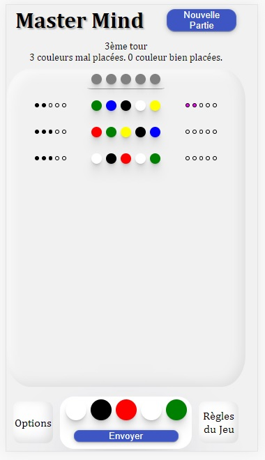
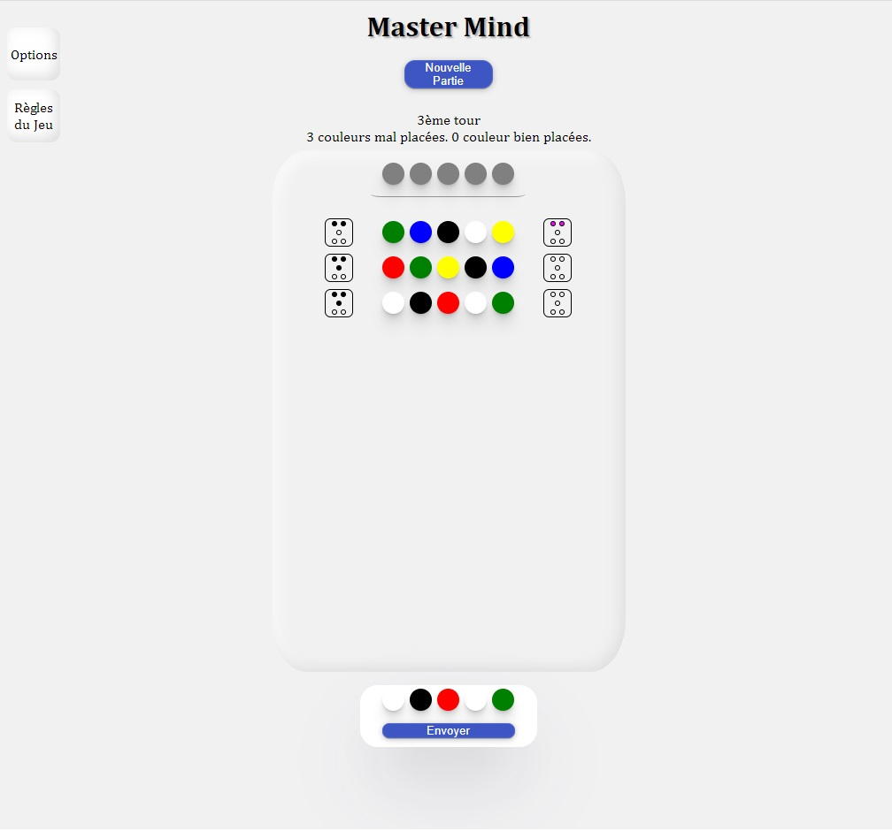

# js-mastermind
## JavaScript / JulienScho
Projet personnel (2021) - Web Mastermind en HTML / CSS - responsive / Javascript

**But du jeu :**

12 chances pour découvrir un code secret composé composé de 5 billes de couleurs différentes. A chaque essai est retourné le nombre de billes bien placées et le nombre de billes présentes dans le code mais mal positionnées.

C'est à tester [ici](https://jsmm.surge.sh/). N'hésitez pas à m'envoyer vos retours. Bon jeu.

**Dans les prochaines versions :**
- Des options pour modifier le niveau de difficulté
- Un indice disponible à mi-parcours
- Amélioration globale visuelle (UI) et utilisation (UX)

## Visuels 

Exemple d'affichage sur smartphone

Exemple d'affichage sur écran pc

